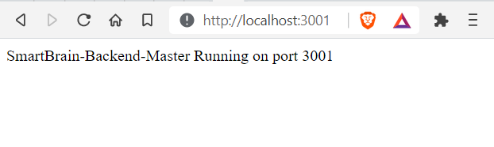

<h1 align="center">SmartBrain Master 'Dockererized' (Front-End Client + Back-End Server) </h1>
<br>


## Description
<p>
</p><br>


## Dependencies/NPM Modules
[NodeMon: v2.0.7 *](https://www.npmjs.com/package/nodemon) - Node.js development tool
<br>

<br><br>


## Installation Prerequisites

### Clarifai API Key
You will need to obtain a free API key from Clarifai<br><br>
API Key Link: https://www.clarifai.com/models/ai-face-detection
<br><br>


Once you have installed PostgreSQL Database, use the following SQL statements to create the Login, Users Tables and Seed them too.
<br><br>


Login Table SQL
````sql
BEGIN TRANSACTION;

CREATE TABLE login (
    id serial PRIMARY KEY,
    hash varchar(100) NOT NULL,
    email text UNIQUE NOT NULL
);

COMMIT;
````
<br><br>


### Redis Database Installation
You will need to install a local instance of Redis server for login authentication with JSON Web Tokens.
<br><br>

PostgreSQL Installation Guide: https://redislabs.com/blog/redis-on-windows-10/
<br><br>

Once you have completed the steps in the 'Installation Prerequisites' above you can continue on to the final installation steps below.
<br><br>


## Installation 
<p>Open your Code Editor and 'CD' into your working directory, then download the repo to that location, by executing the following command in your terminal.<p>

```sh
git clone https://github.com/rbhachu/smartbrain-backend-jwt.git
```

<p>Once the repo has been downloaded, 'CD' to the newly downloaded project folder. Then execute the following command in your terminal.<p>

```sh
npm install
```

<p>Also check for any updates by running the following command too.<p>

```sh
npm update
```
<br>


## Configuration
<p>There is a settings file in the root of the project folder called '.env' which is also known as the Environmental Variables file.
<br><br>
We now need to update this file to use actual values <i>(remove brackets when you replace with actual values)</i> for API_CLARIFAI, POSTGRES_URL and REDIS_URL.
<br>

```env
#SERVER PORT
PORT=3001

#JWT SECRET KEY VALUE
JWT_SECRET=secret

#CLARIFAI API KEY
API_CLARIFAI=(your api key)

#POSTGRESQL DB
POSTGRES_URL=postgres://(<db_username>:<db_password><host_location:host_port>/<db_name>)

#REDIS DB
REDIS_URL=redis://:(<db_password><host_location>:<host_port>)
```
<br>


## Deployment
<p>Finally, to run the app, simply execute the following command in your terminal (ensuring you are in the correct project directory too).</p>

```sh
npm start
```

<p>After a few seconds, your browser should automatically open to the following link; http://localhost:3001 and display the following message in the browser.</p>


<br><br>


## Issues
If you encounter any issues, check the console in your browser, and also check your values for Clarifai API Key, PostgreSQL and Redis connection strings in the .env file are correct too.
<br> 
If you continue to have issues, please drop me a message via LinkedIn and I will try to help you resolve the issue.
<br><br>


## Author
👤 **Rishi Singh Bhachu**<br>
Contact me via [LinkedIn](https://www.linkedin.com/in/rishisinghbhachu/)
<br><br>


## Show your support
If you liked this project it would be greatly appreciated to show your support by simply giving this repo a ⭐️ rating too, many thanks!