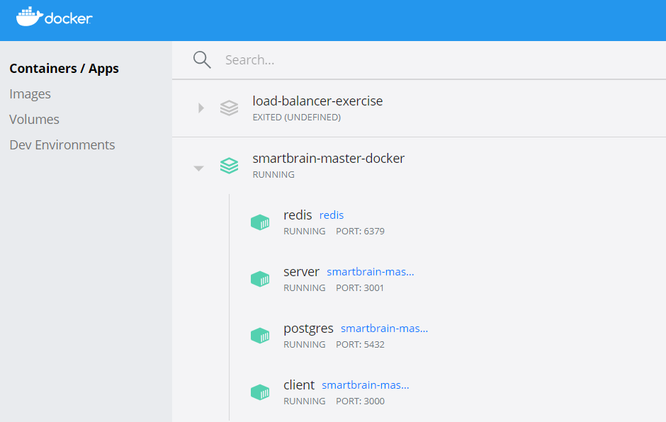
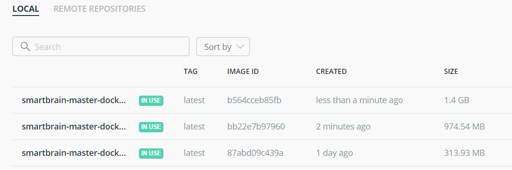
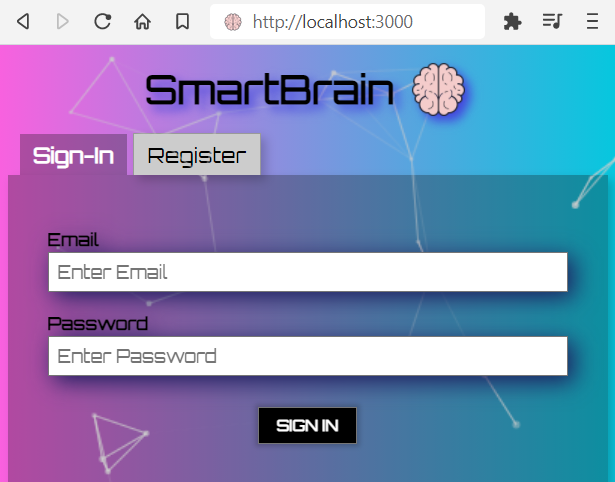
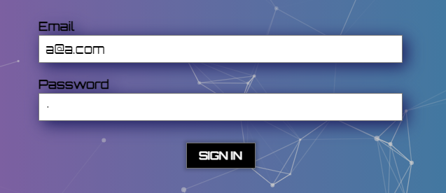
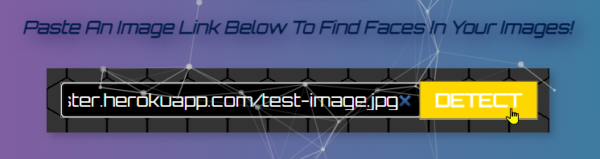
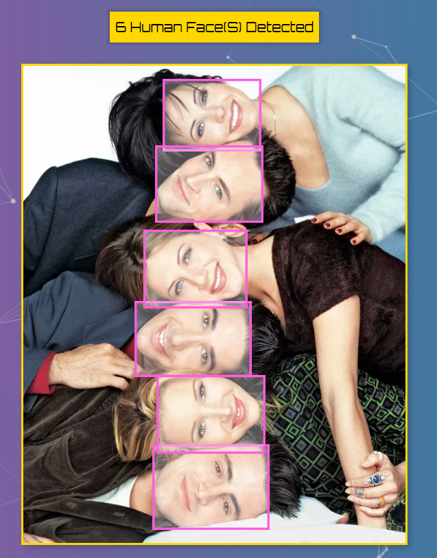
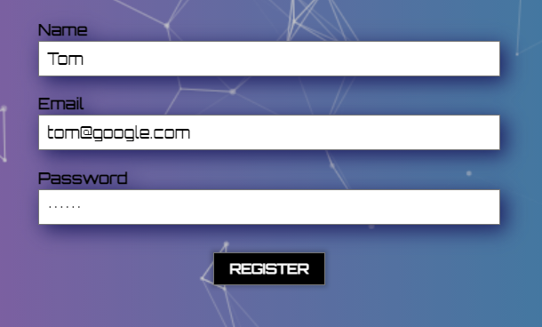

# All SmartBrain Repos
- **SmartBrain v1: [Client](https://github.com/rbhachu/smartbrain-frontend/) / [Server](https://github.com/rbhachu/smartbrain-backend/)** 
- **SmartBrain v2: [Client](https://github.com/rbhachu/smartbrain-frontend-jwt/) / [Server](https://github.com/rbhachu/smartbrain-backend-jwt/)** 
- **SmartBrain Docker v1: [Docker Server](https://github.com/rbhachu/smartbrain-backend-docker)** 
- **SmartBrain Docker v2: [Docker Client + Server](https://github.com/rbhachu/smartbrain-master-docker/)** 

----

<h1 align="center">SmartBrain Docker v2<br>(Fully `Dockererized` Client + Server)</h1>
<br>

## Description

<p>
Fully `Dockerised` version of both Client and Server SmartBrain repos, merged into a single self contained Docker container including a PostgreSQL and Redis Databases.
<br>

_Original separate dedicated repos;_<br>
_**SmartBrain Master Client:** https://github.com/rbhachu/smartbrain-frontend-jwt_<br>
_**SmartBrain Master Server:** https://github.com/rbhachu/smartbrain-backend-jwt_<br>

</p>
<br>

## Installation Prerequisites

<p>

### Docker Desktop

To run the Docker container locally, you will need to have Docker Desktop installed on your computer.<br>
_**Download Link:** https://www.docker.com/products/docker-desktop_
<br><br>

### Clarifai API Key

You will also need a Clarifai API Key (free) which gives access to the Face Detection API component.<br>
_**Download Link:** https://www.clarifai.com/models/ai-face-detection_

</p>
<br>

## Installation

<ul>

<li>
Start Docker Desktop
</li>

<li>
Open your terminal software client (VS code etc)
</li>

<li>
Clone the SmartBrain Master Docker repo to download it to your local computer;

```sh
git clone https://github.com/rbhachu/smartbrain-master-docker.git
```
</li>

<li>
'CD' into the newly downloaded repo directory
</li>

<li>
Open the .env file in the root of site
</li>

<li>
Add your Clarifai API Key to the .env file;

```env
API_CLARIFAI=xxxxxxxxx
```
</li>

<li>
Save the .env file
</li>

<li>
Run the following command in your terminal client (ensuring you are in the root directory of the repo)

```sh
docker-compose up --build
```

</li>
</ul>

<p>
<br>

_**Now grab a cup of tea or coffee, as it will take a few minutes to create the Docker container and images in Docker Desktop**_ ☕
<br>
<br>

Once complete you should see confirmation of successful deployment in your terminal output.
<br>

Your Docker Desktop should also show the SmartBrain-Master-Docker Container and its respective Images (Client, Server, Redis and PostgreSQL), as per the example below;
<br>



</p>
<br>


## Testing
<p>
Check the following links in your web browser load with no issues;<br>

**Client Front-End:** http://localhost:3000<br>
**Server Back-End:** http://localhost:3001<br>




Then test the Sign-In form with the following test login details;<br>
<b>Email:</b> a@a.com
<br>
<b>Password:</b> a



If successful, continue on to a test an image;<br><br>

_Get an image from the web or use the test image link below and paste it into the upload field and click detect_<br>

_**Test Image:** https://rbhachu-smartbrain-f-master.herokuapp.com/test-image.jpg_<br>




<br>
Finally, Sign-Out, then Register as a new user to test its working too.<br>




<br>

**If you have no issues, you have successfully deployed a Docker Container with a fully functioning React App, running an API, PostgreSQL and Redis Databases.**<br> 
**So give yourself a pat on the back!** 👏
</p>
<br>


## Issues
<p>
If however, you do encounter any issues, check the following;

<ul>

<li>
Is Docker Desktop running the SmartBrain Docker Container, with all 4 images (Client, Server, PostgreSQL and Redis) without any issues?
</li>

<li>
Are there any errors being reported for the Client and Server pages in the browser console (CTRL+SHIFT+I > Console Tab)?
</li>

<li>
Have you added the correct key in the .env file for Clarifai API?
</li>

</ul>

<br>
If you still continue to experience issues deploying and running the Docker container please drop me a message via LinkedIn and I will try to help.
</p>
<br>


## Author
👤 **Rishi Singh Bhachu**<br>
Contact me via [LinkedIn](https://www.linkedin.com/in/rishisinghbhachu/)
<br><br>


## Show your support
<p>
If you liked this project it would be greatly appreciated to show your support by simply giving this repo a ⭐️ rating too, many thanks!</p>